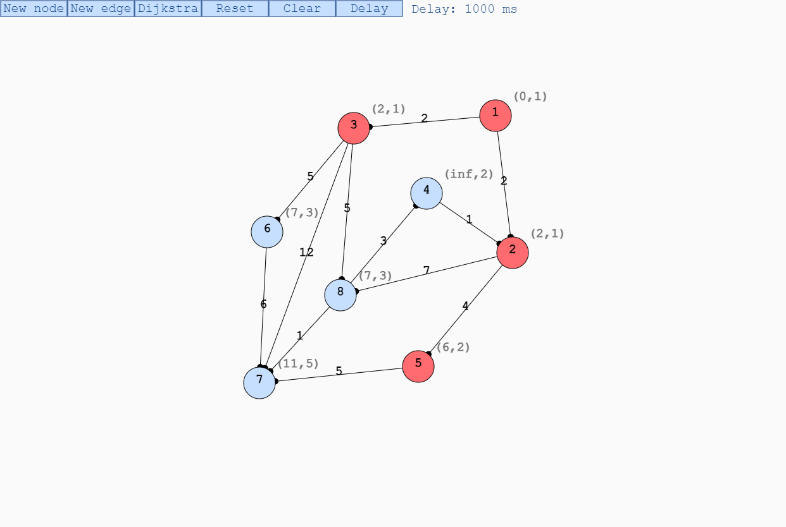
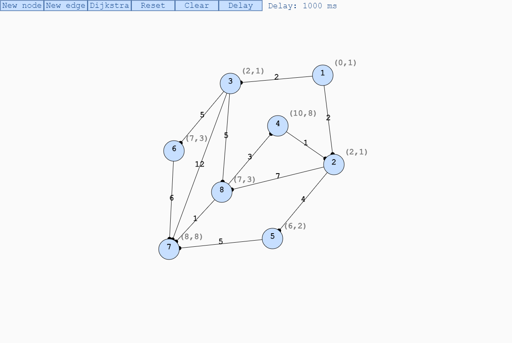

# Dijkstra-visualization

Dijkstra's algorithm is an algorithm for finding the shortest paths between nodes in a weighted graph. It was conceived by computer scientist Edsger W. Dijkstra in 1956.
This program allows you to create a weighted graph and visualize Dijkstra algorithm step by step.

$O(|E|+|V|log|V|)$

## Features
* Add a new node.
* Add a new weighted edge.
* Drag and move nodes.
* Visualize Dijkstra algorithm.
* Reset the graph.
* Clear.
* Configure delay time for visualization.

## Img
**Visualization of each step of the algorithm and its values**

**Result**

